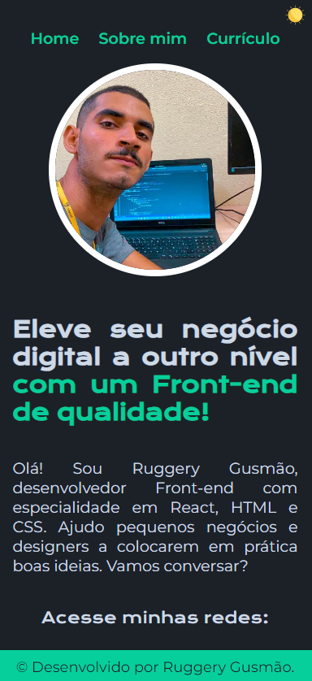

# Portifolio

### 👨🏻‍💻 Sobre o projeto

Projeto desenvolvido na trilha de HTML e CSS realizado pela One Oracle Next Education em parceria com a Alura.

### 🚀  Deploy

Github Pages: [link](https://ruggerygusmao.github.io/learning-page-portifolio/)

### 💻 Versão desktop

</a>

### 📱 Versão mobile

</a>

### 🛠️ Tecnologias 

<code></code>
<code></code>
<code></code>

